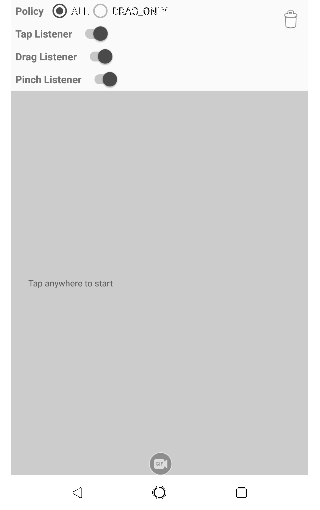
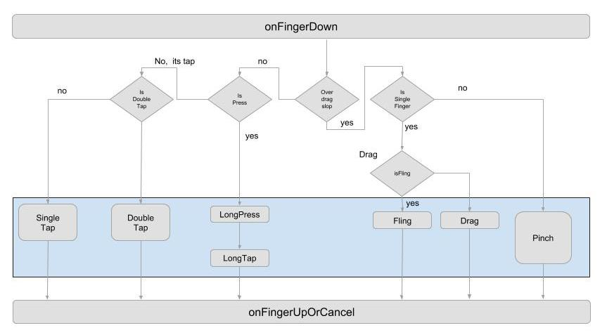
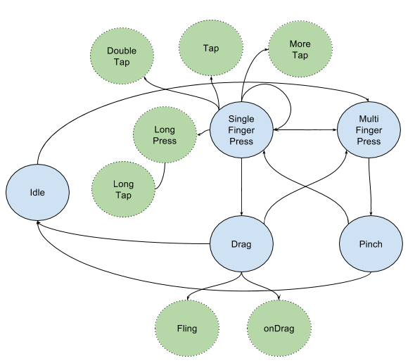

Stateful Gesture Detector
===

- build: [](https://circleci.com/gh/boyw165/stateful-gesture-detector)
- detector: [  ](https://bintray.com/boyw165/android/stateful-gesture-detector/_latestVersion)
- detector-rx: [  ](https://bintray.com/boyw165/android/stateful-gesture-detector-rx/_latestVersion)



A gesture detector having touch lifecycle awareness.

Gradle
---

Add this into your dependencies block.

```
implementation 'io.useful:stateful-gesture-detector:x.x.x' 
implementation 'io.useful:stateful-gesture-detector-rx:x.x.x'
```

If you cannot find the package, add this to your gradle repository

```
maven {
    url 'https://dl.bintray.com/boyw165/android'
}
```

Usage
---

### Without RxJava

Instantiate the detector instance

```kotlin
private val gestureDetector by lazy {
    GestureDetector(Looper.getMainLooper(),
                    ViewConfiguration.get(context),
                    resources.getDimension(R.dimen.touch_slop),
                    resources.getDimension(R.dimen.tap_slop),
                    resources.getDimension(R.dimen.fling_min_vec),
                    resources.getDimension(R.dimen.fling_max_vec))
}
```

Register the listener

```kotlin
// Gesture listener.
gestureDetector.addLifecycleListener(...)
gestureDetector.addTapGestureListener(...)
gestureDetector.addDragGestureListener(...)
gestureDetector.addPinchGestureListener(...)
```

Add to your view's onTouchEvent()

```kotlin
override fun onTouchEvent(event: MotionEvent): Boolean {
    return gestureDetector.onTouchEvent(event, null, null)
}
```

If you use flat view hierarchy designed by yourself, the 2nd and 3rd arguements are useful for you. For example:

```kotlin
override fun onTouchEvent(event: MotionEvent): Boolean {
    return gestureDetector.onTouchEvent(event, 
                                        someTouchingObject, 
                                        payloadOrContext)
}
```

That's it and so simple!

### With RxJava

If you'd prefer the Rx way, try as following, pass the detector to the `GestureEventObservable`:

```kotlin
GestureEventObservable(gestureDetector = ${YOUR_COLLAGE_GESTURE_DETECTOR})
    .subscrible { event ->
        // Handle event... 
    }
```

### How It Works



